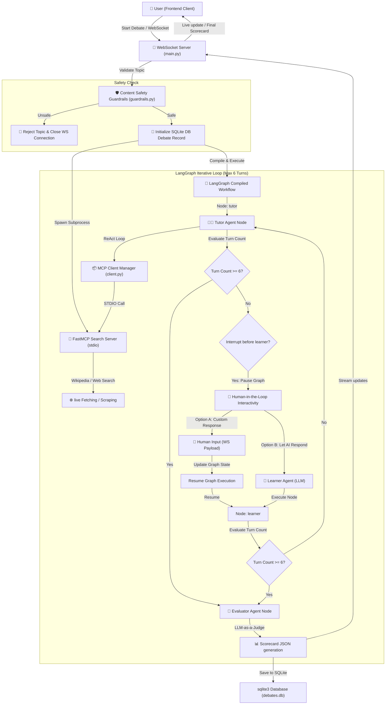

# Autonomous Tutor & Learner Agent Debate with AI Scorecard

A production-grade, educational AI debate and tutoring simulator built using **LangChain**, **LangGraph**, **FastAPI (WebSockets)**, **SQLite**, **Ollama**, and **OpenRouter**.

It simulates an autonomous academic discussion between an **AI Tutor Agent** and an **AI Learner Agent** on any user-selected topic. After a fixed number of turns, an objective **AI Evaluator Agent** (LLM-as-a-Judge) evaluates the learner's understanding, scores the session, and recommends study next steps. The entire workflow streams in **real-time** over WebSockets, letting the user watch the debate unfold and participate directly using Human-in-the-Loop features.

---

## 📸 System Architecture

The following diagram illustrates how the frontend, WebSocket server, LangGraph engine, safety guardrails, MCP server, and human inputs interact:



---

## 🌟 Key Features

1. **Content Safety Guardrails (`backend/app/guardrails.py`)**
   - Intercepts proposed discussion topics before database setup or agent instantiation.
   - Evaluates topics against 6 primary harm categories (Self-harm, hate speech, severe violence, explicit adult themes, cyberattacks, toxic activities) using a specialized LLM classifier.
   - Academic, political, philosophical, or historical topics (e.g. "French Revolution violence") are safely allowed as long as they do not encourage active harm.
   - Built-in resilience: Robust JSON parsing fallbacks and exponential backoff retries for handling API rate-limits (`429` errors).

2. **Human-in-the-Loop (HITL) Interactivity (`backend/app/graph/workflow.py`)**
   - Compiles the LangGraph using `interrupt_before=["learner"]`, freezing execution after the Tutor speaks.
   - The frontend intercepts the pause and displays an input panel, offering two options:
     - **Option A (Type your response)**: The user responds as the learner. The server receives the text, stores it in the database with a `👤 Human` designation, pushes it to the UI, updates the graph's internal thread state via `aupdate_state`, and resumes the graph.
     - **Option B (Let AI Respond)**: The server resumes execution automatically, prompting the Learner LLM agent to generate a response in-character.

3. **Model Context Protocol (MCP) Search Integration (`backend/app/mcp/`)**
   - Implements a local stdio-based `FastMCP` server (`search_server.py`) exposing search capabilities.
   - **Wikipedia Search**: Queries the MediaWiki API using custom User-Agent headers to fetch factual extracts and article summaries.
   - **Web Search**: Scrapes DuckDuckGo search results using BeautifulSoup4.
   - **Live Search Status Indicators**: Pushes real-time status notifications to the frontend over WebSockets, showing a glassmorphic badge with a pulsing micro-animation (e.g., *🔍 Searching Wikipedia for 'Quantum Computing'...*) while tool runs execute.
   - The backend (`client.py`) runs the server as a Python subprocess, translates remote MCP tools into LangChain-compatible `StructuredTool` definitions, and cleans up process handles on connection loss.
   - The Tutor Node binds these tools dynamically and runs a ReAct tool execution loop (capped at 3 iterations) to retrieve factual information on demand.

4. **Real-Time Streaming**
   - Uses WebSockets to broadcast messages, tool invocation logs, and final scorecard analytics back to the web browser turn-by-turn.

5. **AI Evaluator Node (LLM-as-a-Judge)**
   - Compiles the full dialogue, scoring the student's performance from 1 to 10.
   - Extracts key strengths, conceptual gaps, and provides actionable reading lists/recommendations.

6. **SQLite Database Persistence**
   - Maintains a schema of two tables: `debates` (metadata, configuration, evaluation result) and `messages` (sender, content, timestamp, model used). Includes cascade deletion constraints.

7. **Hallucination Mitigation & Self-Correction Verification Loop (`backend/app/graph/nodes.py`)**
   - **Role-Based Temperature Tuning**: Sets a strict temperature (`0.1`) for factual reasoning agents (Tutor, Evaluator, Moderator) to prevent hallucinations, while keeping a creative temperature (`0.7`) for the Learner to ask curious questions.
   - **NLI Fact-Checking judgements**: Integrates a post-generation verification step inside the Tutor node (`check_tutor_faithfulness`) that splits responses into claims and verifies them against the retrieved Wikipedia/web search context.
   - **Self-Correction loop**: If the check flags any claims as unfaithful, the backend triggers a one-time self-correction prompt (streaming a *"⚠️ Recalibrating facts..."* status to the UI) and regenerates the response using the corrected prompt.

8. **Prompt Injection Safety Shield (`backend/app/main.py`)**
   - Sanitizes text inputs in the Human-in-the-Loop input panel against a blacklist of instruction override phrases (e.g., *"ignore previous instructions"*, *"jailbreak"*).
   - Safely intercepts malicious strings and triggers a warning bubble in the UI while keeping the graph paused for a safe retry.

---

## 📁 Project Structure

```text
tutor-learner/
├── backend/
│   ├── app/
│   │   ├── __init__.py
│   │   ├── config.py       # Configuration parser loading env vars
│   │   ├── database.py     # SQLite connection contexts and CRUD operations
│   │   ├── guardrails.py   # LLM safety classification and retry handlers
│   │   ├── mcp/            # Model Context Protocol Client & Server
│   │   │   ├── __init__.py
│   │   │   ├── search_server.py # FastMCP server exposing search tools
│   │   │   └── client.py   # Stdio client managing subprocess lifecycles
│   │   ├── models.py       # Dynamic LangChain LLM instantiators
│   │   ├── graph/
│   │   │   ├── __init__.py
│   │   │   ├── state.py    # LangGraph State definitions
│   │   │   ├── nodes.py    # Tutor, Learner, and Evaluator execution nodes
│   │   │   └── workflow.py # StateGraph registration and compilation
│   │   └── main.py         # FastAPI HTTP endpoints and WebSocket loop
│   ├── .env.example        # Reference environment configuration
│   ├── .env                # Local active credentials (gitignored)
│   ├── debates.db          # Database file (SQLite, auto-generated)
│   └── uvicorn_run.py      # Entrypoint script to launch the FastAPI server
├── frontend/
│   └── index.html          # Light glassmorphism browser dashboard
├── requirements.txt        # Python dependency manifest
└── README.md               # Project documentation
```

---

## 🚀 Installation & Running

### Prerequisite 1: Local Model Configuration (Ollama)
1. Install [Ollama](https://ollama.com/).
2. Start the Ollama background daemon on your machine.
3. Download the default model:
   ```bash
   ollama pull llama3
   ```
   *(To change the model, adjust `OLLAMA_MODEL` inside your `.env` file)*

### Prerequisite 2: Cloud Model Configuration (OpenRouter)
1. Sign up and obtain an API key at [OpenRouter](https://openrouter.ai/).
2. Copy `backend/.env.example` as `backend/.env`.
3. Add your key and optional model choice:
   ```env
   OPENROUTER_API_KEY=your_openrouter_api_key_here
   OPENROUTER_MODEL=google/gemini-2.5-flash
   OLLAMA_MODEL=llama3
   ```

---

### Running the Application

#### Step 1: Install Dependencies
Open your terminal inside the root directory and install requirements:
```bash
pip install -r requirements.txt
```

#### Step 2: Start the FastAPI Server
Navigate to the `backend/` directory and launch the server:
```bash
cd backend
python uvicorn_run.py
```
The server starts at `http://localhost:8000`. You can inspect health status at `http://localhost:8000/health`.

#### Step 3: Open the Frontend Dashboard
Double-click or open `frontend/index.html` in any modern web browser.
1. Check the connection lights in the top right to verify connection status to local and cloud providers.
2. Select your topic (e.g. *Photosynthesis* or *Quantum Computing*).
3. Select your provider mode (Local or Cloud).
4. Click **Start Discussion** to begin.
5. Review, explore, and delete past sessions from the **Debate History** sidebar.

---

## 🛡️ Content Safety Guidelines
The safety guardrail system evaluates user topics against standard criteria.

> [!IMPORTANT]
> - **Blocked content categories**: Explicit self-harm instructions, hate speech or slurs, weapons creation guidelines, hacking/malware exploits, pornography, or extreme toxicity.
> - **Allowed content categories**: Historically sensitive topics, political philosophy discussions, or scientific analyses (e.g. "Ethics of nuclear warfare") are categorized as **safe** and allowed to execute.

---

## 👥 Human-in-the-Loop Flow
When a debate starts:
1. The **Tutor Agent** initiates the conversation by introducing the topic and testing the student.
2. The server streams the message, then pauses before the **Learner Agent** node.
3. The frontend displays the interactive panel:
   - Type your response into the field to respond personally.
   - Click "Let AI Respond" to let the Learner agent respond autonomously.
4. If you write a custom message, it will be marked with a `👤 Human` tag in the chat and stored in SQLite.

---

## 🔌 Model Context Protocol Tools
The **Tutor Agent** has access to two tools exposed via stdio subprocess communication:
- `search_wikipedia(query)`: Uses Wikipedia search to fetch introductory paragraphs and summaries of the most relevant page.
- `web_search(query)`: Leverages BeautifulSoup to extract search result snippets from DuckDuckGo HTML.

> [!NOTE]
> When executing, the backend prints logs showing when the Tutor agent requests search tools:
> `[WS DEBUG] Tutor agent requests tool: search_wikipedia with args: {'query': '...'}`

---

## 📊 Database Schema

The SQLite schema consists of two simple, relational tables:

```sql
CREATE TABLE IF NOT EXISTS debates (
    id INTEGER PRIMARY KEY AUTOINCREMENT,
    topic TEXT NOT NULL,
    mode TEXT NOT NULL,
    model TEXT NOT NULL,
    created_at TIMESTAMP DEFAULT CURRENT_TIMESTAMP,
    evaluation TEXT
);

CREATE TABLE IF NOT EXISTS messages (
    id INTEGER PRIMARY KEY AUTOINCREMENT,
    debate_id INTEGER NOT NULL,
    sender TEXT NOT NULL,
    content TEXT NOT NULL,
    model_used TEXT NOT NULL,
    created_at TIMESTAMP DEFAULT CURRENT_TIMESTAMP,
    FOREIGN KEY(debate_id) REFERENCES debates(id) ON DELETE CASCADE
);
```

---

Made by Francielle Marques (@franciellemdn) with Antigravity 2
